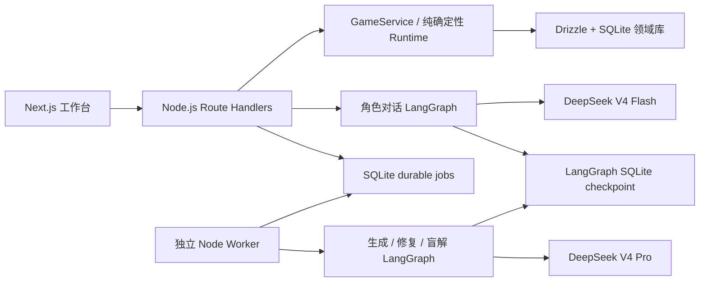

# 疑案档案（CASE//FILE）开发交接

这份文档面向下一次继续开发本仓库的人或 Agent。先读这里和 [CONTEXT.md](CONTEXT.md)，再读 [README.md](README.md)，最后只深入本次改动涉及的模块和对应测试。

## 1. 项目定位

这是一个中文、单人、可重复游玩的 LLM 多 Agent 探案游戏：玩家主动搜证、与角色对话、出示物证、使用提示，并提交一次不可撤回的结案报告。

- 案件：现代现实题材、非血腥；1 名受害者、4 名核心嫌疑人、2–4 名证人/被提及角色、3 个场景、8–12 条证据。
- LLM 的职责：生成案件、扮演角色、审计角色回复、生成结案复盘措辞。
- 确定性代码的职责：案件结构/唯一解校验、证据可达性、解锁、玩家状态、结案评分、幂等、并发和持久化。
- 固定资产：24 张人物头像，游玩时不生成图片。
- 上帝模式：游戏工作台按 `Command + Shift + G`；用于本地调试，可看真相账本、提示词请求、模型回复、命令和事件，但绝不能显示 API Key。

没有 LangSmith，也没有云端多租户或多机扩容目标；这是学习与自娱自乐用的单机/单主机项目。

## 2. 先跑起来

前提：Node.js 22+、pnpm 10。

```bash
cp .env.example .env.local
pnpm install
pnpm dev
```

另开一个终端运行生成 Worker：

```bash
pnpm worker
```

不配置 `DEEPSEEK_API_KEY` 也能完整游玩教程案件、确定性搜证、受约束的兜底对话和结案；随机案件、动态角色对话和模型版复盘需要 Key。

常用检查：

```bash
pnpm lint
pnpm typecheck
pnpm test
pnpm build
pnpm worker:once
```

真实模型发布审计会消耗费用，只有明确需要时才运行：

```bash
LIVE_AUDIT_CASES=10 pnpm audit:live
```

## 3. 总体架构



最重要的边界：

1. `CaseArtifact` 是冻结的案件真相账本；`GameSession` 才是玩家进行中的可变业务状态。
2. 领域 SQLite（case/session/event/command/job）才是业务真相。LangGraph checkpoint 仅用于图的执行恢复，不能用于恢复或判断游戏业务状态。
3. LLM 可以提出候选内容，不能直接改变案件真相、玩家可见信息或分数。
4. 随机案件必须经过确定性发布门禁和不含答案的盲解；失败就修复或拒绝，不能“差不多就发布”。
5. 生成阶段会把模型已声明的 solution 编译成最小证据链元数据；这不改变真凶、动机、手法或可见文案，且仍必须通过盲解，不能把它当成跳过语义验证的捷径。

## 4. 不可破坏的核心不变量

### 案件真相与可解性

- 外部 JSON 进入系统时统一经过 `parseCaseArtifact()`；它会用 Zod 校验并递归冻结对象。
- `GameRepository.registerCase()` 先执行 `validatePublishableCaseArtifact()`，再以内容哈希绑定 `case id`。同一个 id 对应另一份内容必须报冲突，不能覆盖已有案件。
- `validateCaseArtifact()` 负责引用闭合、角色知识边界、可达性与唯一解；`validatePublishableCaseArtifact()` 再检查规模、非血腥内容、首屏泄露与提示词注入式文本。
- `solution.requiredEvidenceIds` 不是说明性字段：这组证据单独必须排除其他嫌疑人，并支持真凶的动机和手法。
- 关键证据链中至少两条必须是 `discovery.method = "interview"` 的关键证词，并写入 `solution.requiredEvidenceIds`；`performInvestigation()` 绝不能用自由搜查命中这类证词，只能由 `recordDialogueTurn()` 在对应角色的问询中取得。
- `compileMinimumSolutionChain()` 只补齐 solution 已声明事实对应的 evidence metadata，并确保必要证据可达；修改它时必须同时验证 `validatePublishableCaseArtifact()` 和盲解。
- `findReachableEvidenceIds()` 用固定点计算理论可达证据，防止循环解锁和“先知道答案才能取得证据”。
- LLM 生成后的盲解只收到公开卷宗和完整可发现证据，不收到 `culpritId`、私密档案、证词真假或真相时间线。

### 玩家状态、事件与并发

- `src/domain/game/game-runtime.ts` 是纯函数状态机：不访问数据库、不调用模型。
- 每个有效 command 只能使 `revision + 1`，并追加一个同 `commandId` 的领域事件。
- 前端请求必须带 `commandId` 和 `expectedRevision`；`game_commands` 的唯一索引和 revision CAS 防重复与并发覆盖。
- 流程是 `accepted/running -> 外部副作用（可能是 LLM） -> 同一事务提交 session + event + command`。绝不能长时间持有数据库事务等模型回复。
- 中断的 running command 在过期后标为 failed；用新的 `commandId` 重试，不能伪造旧命令的结果。

### 角色 Agent 隔离与防泄露

- `privateProfile` 仅供结案复盘等可信场景；**不得**放进角色对话上下文。
- 角色 prompt 只能使用该角色的 `knowledge`、已出示证据、已解锁证词、自己的隐藏状态和自己的对话历史。
- `claimCanBeDisclosed()` 与 `evidenceIsAvailable()` 是所有入口共享的可见性规则。模型 guard、确定性 fallback、写入前 runtime 校验都必须使用它们。
- 对话图顺序固定为：生成 → 确定性校验 → 模型 guard → 有界重试 → 安全兜底。模型回复不会直接写 session。
- checkpoint thread 必须按单条命令隔离：`session:character:command`；不可回退成“每个角色永久一个 thread”，否则旧草稿/重试状态可能串回合。

### 结案、调试与审计

- `submitCaseReport()` 的结果和分数完全确定性。模型只可生成复盘措辞，失败时退回确定性反馈。
- 提前结案仍只有一次机会：必须选择已解锁嫌疑人、引用至少两条已发现证据并写出不少于 10 个字的推理；动机、手法、完整证据链和时间线是加分/完整度项目，不是提前结案的前置条件。真凶正确即为 `solved`，错误指认仍不可撤回。
- 未发现的证据、未发现的动机/手法、或尚未收齐必要证据链时提交的时间线都不能计分。
- `model_runs` 记录模型、prompt hash、token 和成本；请求/回复本身属于调试敏感信息，不得出现在普通玩家视图或日志中。
- 上帝模式接口先验证 session 归属；它只返回本局模型调用，外加该案件的无 session 生成记录，不能读取别人的 session 记录。

## 5. 模块地图

| 位置 | 责任 | 修改时同时检查 |
| --- | --- | --- |
| `src/domain/case/case-artifact.ts` | 真相账本 Zod schema 与冻结 | schema 变更、导入/生成/教程 fixture |
| `src/domain/case/case-validator.ts` | 发布门禁、泄露/注入/可解性校验 | `case-validator.test.ts`、生成 prompt |
| `src/domain/case/case-solver.ts` | 唯一解与必要证据链 | `case-solver.test.ts` |
| `src/domain/case/evidence-reachability.ts` | 固定点可达性 | unlock rule 与证据前置条件 |
| `src/domain/game/game-runtime.ts` | 调查、对话落盘、提示、出示、结案、玩家投影 | `game-runtime.test.ts`、所有 action API |
| `src/application/game/game-service.ts` | 将 API 输入接到 runtime 与仓储 | API schema、幂等参数 |
| `src/infrastructure/persistence/game-repository.ts` | 玩家、案件、session、事件、命令、job、模型审计 | `game-repository.test.ts`、Drizzle schema |
| `src/infrastructure/db/schema.ts` | Drizzle table 定义 | `drizzle/` migration |
| `src/ai/dialogue/*` | 角色上下文、图、结构化 guard | `dialogue-graph.test.ts`、`dialogue-service.test.ts` |
| `src/application/dialogue/dialogue-service.ts` | 调用图、审计、确定性 fallback、提交命令 | checkpoint thread id、可见性测试 |
| `src/ai/generation/*` | 首稿、修复、盲解 LangGraph | 发布门禁、压力测试 |
| `src/application/generation/case-generation-service.ts` | durable job、生成结果入库、成本审计 | Worker 与失败/重试行为 |
| `src/ai/deepseek/deepseek-provider.ts` | DeepSeek/LangChain structured output 与 usage | 真实 API 兼容、价格计算 |
| `src/server/*` | 匿名身份、访问口令、限流、服务单例 | Route Handler 权限与 Node runtime |
| `app/api/*` | HTTP 输入校验与服务调用 | Zod 输入、`runtime = "nodejs"` |
| `src/components/detective-game.tsx` | 游戏工作台、快捷键、可访问性 | 关闭案件后的只读状态、上帝模式对话框 |
| `scripts/worker.ts` | 生成队列轮询、过期任务恢复、优雅退出 | Docker worker 服务 |

## 6. 关键请求流

### 调查 / 提示 / 出示证据 / 结案

1. Route Handler 校验 JSON、身份、限流、`commandId` 与 `expectedRevision`。
2. `GameService` 调用 `GameRepository.executeGameCommand()`。
3. 仓储短事务认领命令；pure runtime 生成下一状态；仓储通过 CAS 原子提交 session、event 与 outcome。
4. 再用 `getPlayerCaseView()` 返回红acted（去除私密真相）的玩家视图。

### 与角色对话

1. `DialogueService` 认领幂等命令，确认角色已解锁。
2. LangGraph 根据最小角色上下文生成草稿，先过确定性校验，再过 Flash guard。
3. 不安全或失败时最多重试；仍失败则返回不泄露信息的确定性回复。
4. `recordDialogueTurn()` 再次验证 claim 和 interview 证据可见性，再将结果写入业务状态。

### 随机案件生成

1. `POST /api/generation` 只创建 SQLite job，返回 `202`；不能在 Next.js request 内同步生成整案。
2. Worker 原子认领 job，运行 `draft -> 编译最小证据链 -> validate -> repair -> blind solve -> finalize/reject`；每个阶段把 stage/progress 写入 `jobs`，并每 10 秒刷新一次 heartbeat，供大厅轮询显示。
3. 成功时 `registerCase()` 再做发布门禁、冻结并写入内容哈希；失败按可重试性重新排队或终止。
4. 每次 job attempt 使用不同 checkpoint thread id，避免恢复旧尝试状态。

## 7. 数据与迁移

领域库默认是 `data/spy-game.sqlite`：

- `anonymous_players`：匿名身份与访问 token hash。
- `case_artifacts`：冻结案件账本、内容哈希、生成元数据。
- `game_sessions`：当前 session 快照与 revision。
- `game_events`：可审计的领域事件。
- `game_commands`：幂等 command 状态和缓存 outcome。
- `jobs`：生成等 durable queue 任务，包含终态 status、当前 stage/progress 和 `updatedAt` heartbeat。
- `model_runs`：请求/回复审计、token、价格估值。
- `agent_threads`：预留的 Agent thread 元数据；当前执行恢复以 LangGraph 的独立 checkpoint 文件为准。

LangGraph checkpoint 默认在 `data/langgraph-checkpoints.sqlite`。两个 SQLite 文件必须在同一台机器的持久本地磁盘上；本地文件库会开启 foreign key、busy timeout 和 WAL。

改表步骤：

```bash
pnpm db:generate
pnpm db:migrate
```

不要手改已应用 migration，也不要删 `data/` 中的用户存档或 checkpoint，除非用户明确要求。

## 8. 环境变量与部署

参考 `.env.example`，不要提交 `.env` / `.env.local`：

```dotenv
DEEPSEEK_API_KEY=
DEEPSEEK_BASE_URL=https://api.deepseek.com
DEEPSEEK_FLASH_MODEL=deepseek-v4-flash
DEEPSEEK_PRO_MODEL=deepseek-v4-pro
DEEPSEEK_STRUCTURED_METHOD=jsonMode
DEEPSEEK_TIMEOUT_MS=180000
ACCESS_PASSWORD=
DATABASE_URL=file:data/spy-game.sqlite
LANGGRAPH_CHECKPOINT_PATH=data/langgraph-checkpoints.sqlite
WORKER_POLL_MS=2000
```

Key 的规则：

- `DEEPSEEK_API_KEY` 只在服务器进程创建 `DeepSeekModelProvider` 时从 `process.env` 读取；不能使用 `NEXT_PUBLIC_` 前缀，也不能从浏览器提交。
- 所有游戏调用均要求结构化输出；V4 强制使用 JSON Mode 并显式关闭 Thinking。不能改回 function calling：该路径会发送 `tool_choice`，与 Thinking 冲突。即使旧环境变量留有 `functionCalling`，V4 也自动覆盖为 JSON Mode；Provider 会把实际 Zod JSON Schema 附加到 prompt，直接读取原始 JSON 响应并在本地校验。不要改回只传“对象示例”的做法，否则案件模型会自造字段，或把底层解析失败折叠成难以排查的 `parsed = null`。
- `DEEPSEEK_TIMEOUT_MS` 默认为 180000（3 分钟），因为完整案件首稿通常需要约一分钟；在网络或模型排队更慢时可以上调。Worker 的 heartbeat 会在请求期间继续刷新 job。
- `.env.local` 用于本地 `pnpm dev` / `pnpm worker`；Worker 与 live audit 脚本会显式自动加载它。Docker 使用根目录 `.env`，由 `docker-compose.yml` 同时注入 `web` 和 `worker`。
- 修改 Key 后需重启本地两个进程；Docker 执行 `docker compose up -d --force-recreate web worker`。不要把 Key 编进 Dockerfile 或镜像。

单机 Docker 发布：

```bash
cp .env.example .env
# 填写 DEEPSEEK_API_KEY；公网环境建议填写 ACCESS_PASSWORD
docker compose up -d --build
```

`web` 与 `worker` 共享 `spy-game-data` 卷。通过 Caddy/Nginx/反向代理绑定域名和 HTTPS 后即可链接游玩。

当前 SQLite/WAL 设计**不适合**无持久盘的 Serverless、网络文件系统、Vercel 多实例或多台 Web 主机。若要多机部署，先迁移领域库与队列到 Postgres/libSQL 服务，并替换 LangGraph checkpoint 的存储方案。

## 9. 改动指南

### 新增一种玩家行动

1. 在 `game-runtime.ts` 定义 command/outcome，并实现纯确定性 transition。
2. 让 transition 通过 `appendEvent()` 仅追加一个事件。
3. 在 `GameService` 中通过 `executeGameCommand()` 接入，保留 `commandId` + `expectedRevision`。
4. 在 action Route 的 Zod union、UI 和测试中接入。
5. 验证重复 command、revision conflict、已结案以及越权输入。

### 扩展案件 schema 或生成规则

1. 修改 `case-artifact.ts` schema 与教程/测试 factory。
2. 在 validator 中添加引用、可达性和可解性规则；必要时扩展 solver。
3. 同步生成 prompt、repair prompt、blind solve 的公开投影。
4. 增加正例与拒绝例测试，再跑生成压力测试。
5. 若结构落库方式改变，再生成 Drizzle migration。

### 修改 Agent / prompt

1. 先确定“谁能知道什么、何时能说什么”，不要只改 system prompt。
2. 最小化传入模型的上下文；私密字段默认不传。
3. 同步修改 deterministic guard、fallback 与写入前 runtime 校验。
4. 增加未知事实、锁定证词、提示词注入、重试恢复与模型故障的测试。
5. 保留 prompt hash、模型名、usage 和价格审计，且不把任何 Key 写入审计。

### 修改 UI / 上帝模式

- 普通玩家 API 只能拿 `getPlayerCaseView()`；不要直接将 `CaseArtifact` 送到前端。
- 结案后所有可编辑控件（包括本地手记）都应只读/禁用。
- 上帝模式快捷键是隐藏调试入口，但接口仍必须验证 session 所属玩家；弹层需有 dialog 语义、焦点处理和 Escape 关闭。

## 10. 验收清单

每次核心改动至少跑：

```bash
pnpm lint && pnpm typecheck && pnpm test && pnpm build
```

若改了生成/队列，再额外跑：

```bash
pnpm worker:once
```

若改了用户可见工作台，手动验证：大厅、教程开始、搜索/点击搜证、对话、出示证据、提示、提交一次报告、关闭后只读、上帝模式打开/关闭。

高风险改动必须新增或更新测试：

- 私密角色事实不能由 prompt、guard 或 fallback 泄露。
- 未满足前置条件的 interview evidence/claim 不能被问出。
- 自由搜查不能绕过角色问询取得 interview evidence；结案报告的“未勾选”只表示未选择写入报告，不能被 UI 表示成“未发现”。
- `requiredEvidenceIds` 不足以锁定案件时必须拒绝发布。
- 伪造的 evidence/timeline/fact id 不能提高结案分数。
- 同 commandId 可重放，不同并发 revision 不能覆盖彼此。
- 生成 worker 中断、lease 过期、重试时不会复用旧图状态。

## 11. 当前已知边界

- DeepSeek 模型输出仍是不可信输入；当前 guard 会阻断结构、ID、明显复述式泄露和角色越界，但任何新的上下文字段都需要单独做泄露测试。
- SQLite 只有一个 writer；当前流量和单 worker 目标下足够，不能用扩容掩盖并发设计问题。
- `model_runs` 的 prompt/response 适合本地调试，部署前应考虑备份、保留期和导出脱敏。
- 实际模型成本取决于调用长度、修复次数与缓存命中。README 的典型值是估算，真实 usage 以 `model_runs` 为准。

## 12. 后续 TODO

以下是已经识别、但尚未实现的工作项。它们不是“立刻阻塞本地学习版”的缺陷；优先级反映的是一旦公开部署、提高并发或扩大内容规模时的风险。

### 与此前确认范围的对照

首版已经覆盖此前确认的核心玩法：随机案件、4 名嫌疑人及其他角色、主动/点击搜证、自由对话、证据出示、解锁/提示、一次性结案、固定头像、隐藏上帝模式、DeepSeek + LangChain/LangGraph，以及 Docker 化单机运行。

真正属于“此前希望实现、但 MVP 还未真正交付”的只有两类：

- **可分享的公网链接发布**：仓库已经有 Docker Compose 和反向代理接入说明，但尚未选择实际 VPS/托管平台、域名和 HTTPS 并完成上线；这需要部署目标与对应权限。
- **真实模型质量与成本基线**：已在真实 DeepSeek Key 下完成一局“首稿 → 校验 → 盲解 → 发布”烟测，但尚未有多样本通过率、修复次数与成本基线。

以下几项是已明确的产品取舍，**不要误列为待办**：每局生成唯一头像（目前固定 24 张头像即为选择）、默认接入 LangSmith、以及为上帝模式增加环境开关。若产品方向改变，再单独立项。

| 优先级 | TODO | 当前状况与完成标准 |
| --- | --- | --- |
| P0 | 为 Worker 增加可续租的 lease / fencing token | 当前 Worker 已每 10 秒写入 heartbeat，能避免正常长调用被 30 分钟 stale 检查误判；但还没有按 attempt 的 lease token/fencing，`completeJob`/`failJob` 也未检查条件更新行数。完成时：claim 返回 lease token，完成/失败以 token CAS，Worker 定期续租或周期性回收过期任务，并有并发测试。 |
| P0 | 让“生成成功、模型审计写入、job 完成”具备可恢复一致性 | 当前案件注册成功后，若 `model_runs` 写入失败，调用会报错并触发重试；虽有案件内容哈希保护，但审计与 job 终态可能暂时不一致。完成时：设计 outbox/补偿任务或明确可重放的审计状态，并覆盖持久化失败测试。 |
| P1 | 强化角色语义泄露防护 | 当前确定性 guard 能拦截未授权 claim id、内部标记与明显逐字复述，但无法可靠判断模型对未知事实的改写/释义。完成时：把可说内容绑定为结构化 claim/fact provenance，或增加独立语义审计；加入“私密事实被同义改述”的回归测试。 |
| P1 | 处理 `unlockRules.targetType = "analysis"` 的模型缺口 | schema 允许 `analysis`，但没有对应 analysis 实体或 runtime 行为，validator 目前按 evidence target 处理。完成时：要么删除该未实现类型并迁移数据，要么建立 analysis 实体、引用校验、解锁与玩家视图。 |
| P1 | 为公开链接明确上帝模式的授权策略 | 当前模式符合“自娱自乐、隐藏快捷键”的目标，但快捷键不是安全边界，拥有同一玩家身份的人可读取自己的完整真相。若要给陌生人公开游玩，完成时：增加独立调试授权/管理员校验，或在公开环境关闭该接口。 |
| P2 | 数据保留、备份与调试导出脱敏 | `model_runs` 可能长期积累完整 prompt/response，SQLite 文件也会不断增大。完成时：定义清理期限、备份/恢复流程、导出脱敏规则与手动清理命令。 |
| P2 | 发布为可分享的公网链接并完成 Docker 端到端验收 | Docker 配置已就绪，但尚未选定主机/域名并实际发布；当前开发环境也没有 Docker CLI 可做 compose 烟测。完成时：选择目标主机，验证 `web` + `worker` 共用卷、重启后存档/队列恢复、反向代理 HTTPS、Key 轮换后两个服务重建，并交付可访问链接。 |
| P2 | 做一次真实 DeepSeek 生成质量/成本基线 | 已完成 1 局真实端到端烟测，不代表真实模型稳定性。完成时：有预算时运行 `LIVE_AUDIT_CASES=10 pnpm audit:live`，记录通过率、修复次数、耗时、实际 `model_runs` 成本和失败样本。 |
| P2 | 继续完善移动端与无障碍验收 | 重点检查小字号对比度、窄屏 mode strip、证据栏/底部提示遮挡，以及上帝模式/对话框的纯键盘焦点流。完成时：修复确认的问题，并保留相应的手动验收步骤或组件测试。 |
| 条件触发 | 多机/高可用部署迁移 | 只有产品目标变成多主机后才做：领域库与队列迁移至 Postgres/libSQL 服务，LangGraph checkpoint 换为可共享存储，并重新设计限流、任务锁和备份。 |

开始任何 TODO 前，先确认它不会破坏第 4 节的不变量；如果会改变数据模型或 Agent 可见性，必须先补测试再改实现。

## 13. 推荐的下次接手顺序

1. 读本文件和 README，确认本次目标是否碰到上述不变量。
2. 运行 `pnpm typecheck && pnpm test`，先获得干净基线。
3. 找到对应模块和同名测试，优先用测试固定目标行为。
4. 修改后运行完整验收；涉及真实 DeepSeek 时再决定是否有预算执行 live audit。
