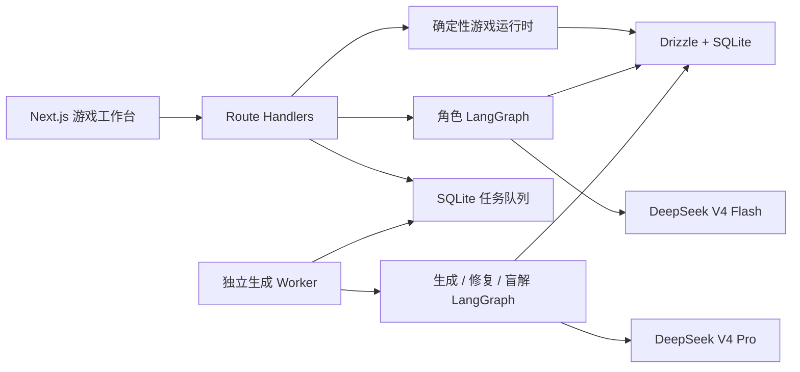

# Final Alibi · 疑案档案

> A replayable LLM-powered detective game — explore scenes, interrogate suspects, follow the evidence, and make one final accusation.
>
> 一款可重复游玩的中文 LLM 多 Agent 探案游戏：主动搜证、自由问询、缕清真相，并在唯一一次结案机会中锁定真凶。

`Next.js` · `TypeScript` · `LangChain / LangGraph` · `DeepSeek V4` · `Drizzle + SQLite`

## 游戏流程

1. 阅读案件背景，前往不同现场，用自然语言描述你的搜查行动。
2. 向嫌疑人与证人提问；部分关键线索只会在问对人、问对问题时出现。
3. 在只包含已发现线索的线索簿中整理证据、证词与时间线。
4. 选择继续调查，或以“真凶 + 至少两条已发现证据 + 推理陈述”提前结案。无论是否提前结案，每局都只有一次提交机会。

## 核心特性

- 模板约束 + DeepSeek V4 Pro 生成案件，人物规模与访谈分工随种子变化；经过结构、唯一解、可达性、公开信息与证据语义审查、有限修复和独立盲解后才发布。发布门禁会从零访谈和少于本案所需访谈人数的状态重新计算可达证据，避免必要证词沦为装饰，同时允许两名人物提供可替代的调查路线。
- 每个角色拥有独立知识、秘密、谎言规则、隐藏心理状态与对话记忆；每条对话命令使用隔离的 LangGraph checkpoint thread，角色回复再经过确定性检查和第二个模型守卫。
- 在当前场景主动描述搜查行动或点击物件搜证，支持渐进场景/人物解锁、向人物出示私有证据、三级提示与本地手记。结案草稿按存档保存在本浏览器；返回或刷新后可恢复对质。人物询问各自保留输入草稿，阅读旧记录时新回复不会打断滚动。
- 一次性结构化结案：锁定真凶、引用至少两条已发现线索并写出推理后即可提前结案；动机、手法、完整证据链与时间线决定额外得分。结案后会完整解密所有真相、人物秘密、证词和未取得线索的确定性获取路线；分数完全由确定性规则计算，LLM 只生成不参与评分的复盘建议。
- SQLite + Drizzle 的不可变案件真相、版本化游戏状态、事件日志、幂等命令、CAS 并发控制、任务队列、模型调用与成本审计。
- 玩家接口与独立盲解均使用无角色含义的实体编号，避免内部编号提前透露答案。玩家编号使用数据库中持久保存的专用随机密钥计算，公开生成种子不能反推编号；人物在同类角色中按中性编号稳定排列，避免生成顺序暗示真凶；入站引用须属于当前存档已提供的选项。原有案卷和存档编号保持不变，首次启动时自动增加密钥表。
- 结案前不通过开案信息或重建选项暴露后台设定的精确作案时刻；玩家需根据取得的报告、记录与证词确定作案窗口，再核验不在场证明。重建选项展示经过顺序，结案复盘才揭示完整真相时间线。
- 随机案件生成会显示当前阶段与平滑进度；刷新页面后会继续追踪本浏览器提交的任务。
- 24 张固定半写实人物头像，不在游玩时产生图片成本。
- 匿名持久化、可选共享访问口令、接口限流、案件包校验导入与调试导出。
- 隐藏只读上帝模式：在游戏工作台按 `Command + Shift + G`，可检查完整真相、私有角色状态、提示词请求、模型回复、命令和事件；不会显示 API Key。

## 快速开始

要求 Node.js 22+ 与 pnpm 10。

```bash
cp .env.example .env.local
pnpm install
pnpm dev
```

### 配置 DeepSeek API Key

本地开发时，打开项目根目录刚创建的 `.env.local`，把第一行改为你的 Key：

```dotenv
DEEPSEEK_API_KEY=你的_DeepSeek_API_Key
```

保存后，重启 `pnpm dev`；如果 Worker 已启动，也需要重启 `pnpm worker`，因为两个服务都会在启动后读取环境变量。项目的 `pnpm worker`、`pnpm worker:once` 和 `pnpm audit:live` 会自动读取本地 `.env.local`。Key 只应保存在 `.env.local` / 部署服务器的 `.env` 中，**不要**使用 `NEXT_PUBLIC_` 前缀、提交到 Git，或填入前端代码。

其余 DeepSeek 配置已有默认值，通常无需修改：

```dotenv
DEEPSEEK_BASE_URL=https://api.deepseek.com
DEEPSEEK_FLASH_MODEL=deepseek-v4-flash
DEEPSEEK_PRO_MODEL=deepseek-v4-pro
```

常规对话、案件首稿、通用修复补丁和证据语义审查关闭 Thinking；取得路线修复、公开信息审查与独立盲解采用官方支持的 [`low` 推理强度](https://api-docs.deepseek.com/guides/thinking_mode/)。取得路线修复提供绕过必要访谈仍可定案的具体证据链，使用包含推理的 9200 token 输出预算。证据审查逐项返回原文来源和时间区间，由代码核验来源权限、证明覆盖完整性，以及不在场证据是否覆盖完整公开作案窗口。修复仅携带当前问题所需的上下文，并保留关联证据和作者时间线；已经审核的公开窗口及其边界原文单独传入，补丁修改后重新审核，避免将内部精确时刻当作玩家已知信息。DeepSeek V4 的结构化输出统一使用 JSON Mode，不发送 `tool_choice`，并附带实际 JSON Schema。即使旧 `.env.local` 仍写着 `DEEPSEEK_STRUCTURED_METHOD=functionCalling`，V4 也会自动走 JSON Mode。每次模型请求及其内部重试共享 `DEEPSEEK_TIMEOUT_MS` 设置的总时限（默认 180 秒）。

证据语义审查按证明关系分组，同条证据每组最多 4 项，访谈入口逐项审查。每组请求 3200 token 的输出预算，最多并发 2 组；单轮最多 20 组，每次执行共享 240 秒截止时间，组内调用不自动重试。每组及最终汇总均检查覆盖完整性和来源权限，任一调用或协议失败会停止后续组并取消在途请求。取得路线补丁先在临时稿中校验；若引入新的确定性阻断问题，会整体拒绝并保留原稿和待修上下文。首稿加修复最多 6 次尝试，被拒补丁仍计入次数，断点恢复不重置。失败调用已返回的 usage 也计入审计；取消请求未返回用量时标记为未知。

另开一个终端启动案件生成 Worker：

```bash
pnpm worker
```

大厅的生成区会显示“草稿 → 校验 → 修复（如需要）→ 审查与盲解 → 归档”的真实阶段与平滑进度。若长时间没有进展，请查看运行 `pnpm worker` 的终端。

打开 [http://localhost:3000](http://localhost:3000)。未配置 `DEEPSEEK_API_KEY` 时，教程案件、搜证、受约束的确定性角色对话与结案复盘仍可完整游玩；随机案件生成、DeepSeek 动态角色对话和模型生成的复盘措辞需要 Key。

内置《雨夜书房》已更新为 v5，重新核对了 11 条线索的时间依据和取证前置。旧存档继续使用原案卷，从大厅重新启封可体验新版。

首次运行会自动执行 `drizzle/` 中的迁移，并创建：

- `data/spy-game.sqlite`：案件、存档、事件、任务与审计记录；
- `data/langgraph-checkpoints.sqlite`：角色与生成图的 LangGraph checkpoint。

## 架构



领域事件和版本化游戏状态是业务真相；LangGraph checkpoint 只用于 Agent 执行状态与恢复。生成成功后，案件 truth ledger 按内容哈希冻结，运行中的案件不会因模型或提示词升级而改变。

## 成本估算

计价基于 2026-08-31 的 [DeepSeek 官方价格页](https://api-docs.deepseek.com/quick_start/pricing/)。应用按每次真实 usage 分离缓存命中/未命中 token，并在 `model_runs` 中记录人民币微元估值。

以下为一组用量假设下的计算示例，不是单局费用上限。证据审查单轮请求的输出预算合计最多 64k token，修复后的新一轮审查、首稿与其他模型调用另计，实际计费仍按已返回的 usage：

| 阶段 | 模型 | 输入 | 输出 | 低峰估算 |
| --- | --- | ---: | ---: | ---: |
| 生成、必要修复、盲解 | V4 Pro | 85k | 25k | ¥0.7200 |
| 约 20 轮对话、守卫、结案反馈 | V4 Flash | 175k | 46k | ¥0.4695 |
| 合计 |  | 260k | 71k | **¥1.1895** |

工作日北京时间 09:00–12:00、14:00–18:00 按官方峰值价格约 **¥2.379/局**。重试、长对话与案件修复会提高实际消耗；KV cache 命中会降低消耗。固定头像不产生每局费用。

## 测试与数据结构

```bash
pnpm typecheck
pnpm lint
pnpm test
pnpm build
pnpm worker:once
```

标准测试包含 10 次连续案件发布门禁与完整结案流的无付费压力测试。配置 Key 后可另外运行真实模型审计（默认会产生 10 个案件及相应 API 费用）：

```bash
LIVE_AUDIT_CASES=10 pnpm audit:live
```

需要修改表结构时：

```bash
pnpm db:generate
pnpm db:migrate
```

案件 JSON 由 `CaseArtifact` 严格 schema 校验。调试模式导出的 `.case.json` 可以在大厅导入；同一案件 ID 若对应不同真相哈希会被拒绝，避免进行中的案件真相漂移。

## 用 Docker 发布为链接

在一台带持久磁盘的单机 Node 主机/VPS 上：

```bash
cp .env.example .env
# 编辑根目录 .env：填写 DEEPSEEK_API_KEY=你的_DeepSeek_API_Key
# 公网部署时建议同时填写 ACCESS_PASSWORD=一个访问口令
docker compose up -d --build
```

如果容器已经在运行，修改 `.env` 后执行以下命令让 `web` 与 `worker` 读取新 Key：

```bash
docker compose up -d --force-recreate web worker
```

服务暴露在主机 `3000` 端口；再通过 Caddy、Nginx 或托管平台绑定域名和 HTTPS，即可通过链接游玩。`web` 与 `worker` 共享 `spy-game-data` 卷。

当前 SQLite/WAL 方案面向本地学习和单主机部署。不要把数据库文件放在网络文件系统，也不要横向扩容多个 Web 主机；若后续需要多机部署，应将领域库迁移到 Postgres/libSQL 服务，并把 LangGraph checkpointer 换成 Postgres/Redis。
